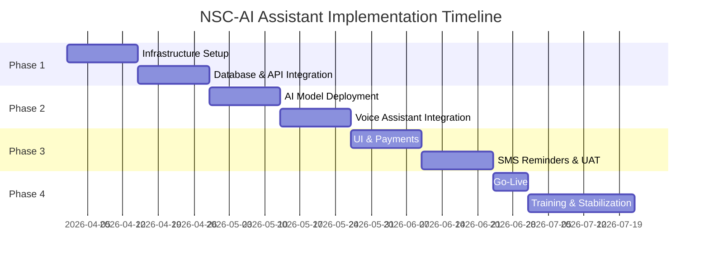
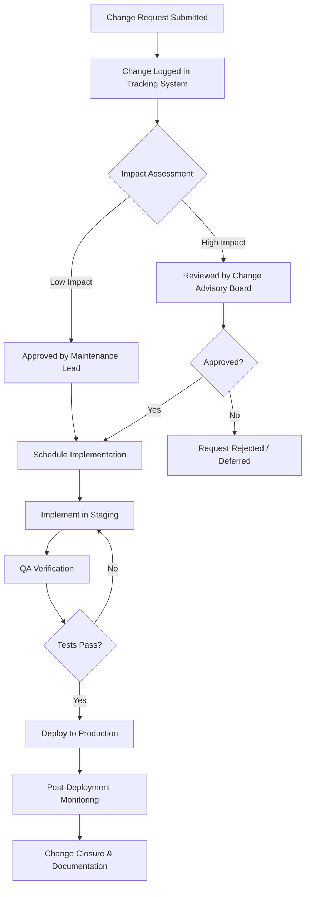

# NSC-AI ASSISTANT — IMPLEMENTATION PLAN

**Project Name:** NSC-AI Assistant  
**Description:** AI-Powered Dermatologist Booking Platform  
**Date:** March 18, 2026  
**Version:** 1.0

---

## Table of Contents

1. [Implementation Schedule](#1-implementation-schedule)
2. [Installation & Conversion Plans](#2-installation--conversion-plans)
3. [Training Plan](#3-training-plan)
4. [Software Maintenance Plan](#4-software-maintenance-plan)
5. [Change Management Plan](#5-change-management-plan)

---

## 1. Implementation Schedule

The NSC-AI Assistant implementation follows a phased approach over **16 weeks**, divided into four major phases.

### Phase 1 — Infrastructure & Core Setup (Weeks 1–4)

| Week | Activity | Deliverable | Responsible |
|------|----------|-------------|-------------|
| 1 | Cloud infrastructure provisioning (servers, databases, storage) | Production-ready hosting environment | DevOps Engineer |
| 1–2 | Domain registration, SSL certificates, DNS configuration | Secure public-facing endpoints | DevOps Engineer |
| 2–3 | Database schema deployment (users, bookings, prescriptions, payments) | Fully migrated production database | Backend Developer |
| 3–4 | Africa's Talking SMS API integration & M-Pesa Daraja API integration | Functional SMS & payment gateways | Backend Developer |

### Phase 2 — AI & Voice Module Deployment (Weeks 5–8)

| Week | Activity | Deliverable | Responsible |
|------|----------|-------------|-------------|
| 5–6 | Deploy AI image-analysis model (dermatology severity scoring 1–10) | Operational severity classification endpoint | AI/ML Engineer |
| 6–7 | Voice assistant agent integration (speech-to-text, NLU, booking flow) | Users can book appointments via voice | AI/ML Engineer |
| 7 | Urgent-case slot logic (2 reserved daily slots for severity 8–10) | Priority scheduling engine | Backend Developer |
| 8 | End-to-end integration testing of AI + voice + booking pipeline | Verified booking workflow | QA Engineer |

### Phase 3 — User-Facing Features & Testing (Weeks 9–12)

| Week | Activity | Deliverable | Responsible |
|------|----------|-------------|-------------|
| 9–10 | Image upload UI, booking dashboard, prescription management | Complete patient-facing interface | Frontend Developer |
| 10–11 | M-Pesa payment flow for bookings and prescriptions | Verified payment lifecycle | Backend Developer |
| 11 | 48-hour SMS appointment reminder service (Africa's Talking) | Automated reminder cron job | Backend Developer |
| 12 | User acceptance testing (UAT) with pilot dermatology clinic | UAT sign-off report | QA Engineer / Stakeholders |

### Phase 4 — Go-Live & Stabilization (Weeks 13–16)

| Week | Activity | Deliverable | Responsible |
|------|----------|-------------|-------------|
| 13 | Production deployment & data migration | Live production system | DevOps Engineer |
| 14 | Staff & end-user training sessions | Trained user base | Project Manager |
| 15 | Monitored live operation with rapid-response support | Stability metrics dashboard | Full Team |
| 16 | Post-implementation review & handover | Project closure report | Project Manager |

### Milestones Summary

---

## 2. Installation & Conversion Plans

### 2.1 Software Installation Plan

| Component | Technology | Installation Method |
|-----------|-----------|-------------------|
| **Web Application Server** | Node.js / Python (Django/Flask) | Deployed via Docker containers on cloud VPS (e.g., AWS EC2, DigitalOcean) |
| **Database** | PostgreSQL | Managed cloud database instance (e.g., AWS RDS) |
| **AI/ML Model** | TensorFlow / PyTorch (Dermatology CNN) | Containerized model served via REST API (TensorFlow Serving / FastAPI) |
| **Voice Assistant** | Google Dialogflow / Rasa NLU | Cloud-hosted NLU agent connected via webhook |
| **Payment Gateway** | Safaricom M-Pesa Daraja API | Server-side SDK integration (STK Push for C2B payments) |
| **SMS Service** | Africa's Talking SMS API | Server-side SDK (Node.js / Python) with sandbox → production migration |
| **File Storage** | AWS S3 / Cloudinary | Cloud object storage for patient image uploads |
| **CI/CD Pipeline** | GitHub Actions / Jenkins | Automated build, test, and deploy on push to `main` branch |
| **Monitoring** | Prometheus + Grafana / Sentry | Application performance monitoring and error tracking |

### 2.2 Hardware Requirements

| Resource | Specification | Purpose |
|----------|--------------|---------|
| **Application Server** | 4 vCPUs, 8 GB RAM, 100 GB SSD | Hosts backend API and web application |
| **AI Inference Server** | 4 vCPUs, 16 GB RAM, GPU-enabled (optional) | Runs dermatology image severity model |
| **Database Server** | 2 vCPUs, 8 GB RAM, 200 GB SSD | PostgreSQL data storage |
| **Client Devices** | Smartphone / PC with modern browser | End-user access (patients and dermatologists) |

### 2.3 Activities of Conversion

The conversion plan covers migrating from the clinic's existing manual or legacy booking system to the NSC-AI Assistant.

| Activity | Description | Duration |
|----------|-------------|----------|
| **Data Audit** | Inventory all existing patient records, appointment logs, and prescription data from the current system | 1 week |
| **Data Cleansing** | Standardize patient records (names, phone numbers in E.164 format for SMS), remove duplicates | 1 week |
| **Data Migration** | Script-based ETL (Extract, Transform, Load) of cleansed data into the NSC-AI PostgreSQL database | 3 days |
| **Validation** | Cross-verify migrated data against source records; generate discrepancy report | 2 days |
| **Legacy System Archival** | Archive old system data and maintain read-only access for 12 months | 1 day |

### 2.4 System Conversion Strategy

The project will use a **Phased (Modular) Conversion Strategy**:

| Phase | Module Going Live | Parallel Operation |
|-------|-------------------|-------------------|
| **Phase A** | User registration + AI image upload & severity scoring | Yes — manual booking continues alongside |
| **Phase B** | Appointment booking (including voice assistant) + urgent-case slot allocation | Yes — staff validate AI bookings against manual log |
| **Phase C** | M-Pesa payment processing for bookings & prescriptions | Yes — manual receipts issued in parallel for 2 weeks |
| **Phase D** | SMS reminders (48-hour prior) + full system handover | No — legacy system retired |

**Rationale:** Phased conversion reduces risk by allowing staff to validate each module before the next goes live. The parallel operation period ensures no patient data or appointment is lost during transition.

**Rollback Plan:** If a critical failure occurs during any phase, the clinic reverts to the previous phase's configuration. Database snapshots are taken before each phase activation to enable point-in-time recovery.

---

## 3. Training Plan

### 3.1 Training Audience & Objectives

| Audience | Training Objective |
|----------|--------------------|
| **Patients / End Users** | Register, upload skin images, book appointments (voice & manual), pay via M-Pesa, understand severity scores |
| **Dermatologists** | Review AI severity scores, manage appointment slots, view patient image history, process prescriptions |
| **Clinic Administrators** | Manage user accounts, monitor bookings, view payment reports, configure urgent-care slots |
| **IT Support Staff** | System monitoring, basic troubleshooting, SMS/payment API health checks, incident escalation |

### 3.2 Training Methods

| Method | Description | Audience | Duration |
|--------|-------------|----------|----------|
| **Instructor-Led Training (ILT)** | Hands-on walkthrough sessions conducted on-site or via Zoom with live demonstrations of the system | Dermatologists, Clinic Admins | 2 × 3-hour sessions |
| **Interactive Video Tutorials** | Pre-recorded screen-capture videos covering registration, image upload, booking, and payment, hosted on the platform's help centre | Patients / End Users | 5–10 min per module (self-paced) |
| **User Manual / Quick-Start Guide** | PDF/HTML documentation with step-by-step screenshots for each feature | All users | Distributed at launch |
| **Sandbox Environment** | A staging copy of the system pre-loaded with test data, allowing users to practice without affecting live records | Dermatologists, Admins, IT Staff | Available 2 weeks pre-launch |
| **On-the-Job Support** | Dedicated support personnel embedded in the clinic for the first 2 weeks post-launch to assist with real-time queries | All staff | Weeks 14–15 |
| **FAQs & Chatbot** | In-app help section with frequently asked questions and an AI chatbot for common queries | Patients | Ongoing |

### 3.3 Training Schedule

| Week | Activity | Audience |
|------|----------|----------|
| Week 12 | Sandbox environment opened; quick-start guides distributed | All |
| Week 13 | Instructor-led sessions (Session 1: Overview & Booking; Session 2: AI Features & Payments) | Dermatologists, Admins |
| Week 13 | IT staff technical training (monitoring, API dashboards, incident response) | IT Support |
| Week 14 | Video tutorials published; patient onboarding begins | Patients |
| Weeks 14–15 | On-the-job embedded support | All staff |

---

## 4. Software Maintenance Plan

### 4.1 Maintenance Categories

| Type | Description | Frequency |
|------|-------------|-----------|
| **Corrective Maintenance** | Bug fixes for reported defects (e.g., SMS not sent, payment callback failure, incorrect severity score) | As needed (within SLA) |
| **Adaptive Maintenance** | Updates required by external changes — M-Pesa API version upgrades, Africa's Talking SDK updates, OS/runtime patches | Quarterly review |
| **Perfective Maintenance** | Feature enhancements requested by users (e.g., additional language support for voice assistant, new payment methods) | Bi-annual release cycle |
| **Preventive Maintenance** | Proactive activities — database optimization, log rotation, security vulnerability scanning, AI model retraining with new dermatology datasets | Monthly |

### 4.2 Service Level Agreements (SLA)

| Severity | Description | Response Time | Resolution Time |
|----------|-------------|---------------|-----------------|
| **Critical** | System down, payments failing, urgent-case slots not allocating | 1 hour | 4 hours |
| **High** | AI severity scoring inaccurate, SMS reminders not sending | 4 hours | 24 hours |
| **Medium** | UI bugs, minor display issues, non-blocking errors | 1 business day | 3 business days |
| **Low** | Feature requests, cosmetic improvements, documentation updates | 3 business days | Next release cycle |

### 4.3 Maintenance Activities

| Activity | Description | Schedule |
|----------|-------------|----------|
| **Database Backups** | Automated daily backups with 30-day retention; weekly off-site replication | Daily (automated) |
| **Security Patching** | Apply OS, runtime, and dependency security patches | Monthly or as CVEs are disclosed |
| **AI Model Monitoring** | Track severity-score accuracy metrics; retrain model if precision drops below 85% | Monthly review |
| **API Health Checks** | Automated uptime monitoring for M-Pesa Daraja and Africa's Talking endpoints | Continuous (5-min intervals) |
| **Log Review** | Analyse application logs for errors, performance bottlenecks, and suspicious activity | Weekly |
| **Dependency Audit** | Run `npm audit` / `pip audit` to flag vulnerable packages | Monthly |

### 4.4 Maintenance Team

| Role | Responsibility |
|------|---------------|
| **Maintenance Lead** | Triages incoming issues, assigns to engineers, tracks SLA compliance |
| **Backend Engineer** | Fixes API, payment, and SMS defects; applies patches |
| **AI/ML Engineer** | Monitors and retrains severity-scoring model; handles AI-related bugs |
| **DevOps Engineer** | Manages infrastructure, backups, deployments, and CI/CD pipeline |
| **QA Engineer** | Validates fixes in staging before production release |

---

## 5. Change Management Plan

### 5.1 Change Management Objectives

- Ensure all system changes are evaluated, approved, and documented before implementation.
- Minimize disruption to clinic operations and patient experience during changes.
- Maintain data integrity and system stability throughout the system lifecycle.

### 5.2 Change Request Process

### 5.3 Change Categories

| Category | Examples | Approval Authority |
|----------|---------|-------------------|
| **Standard** | Routine patches, dependency updates, minor UI tweaks | Maintenance Lead |
| **Normal** | New feature rollout (e.g., adding Airtel Money), AI model retrain, API migration | Change Advisory Board (CAB) |
| **Emergency** | Critical security vulnerability, payment gateway outage, data breach response | Maintenance Lead + Project Sponsor (expedited) |

### 5.4 Change Advisory Board (CAB)

| Member | Role |
|--------|------|
| Project Manager | Chairperson |
| Lead Developer | Technical assessment |
| Clinic Administrator | Operational impact evaluation |
| Dermatologist Representative | Clinical workflow impact |
| QA Engineer | Testing and risk assessment |

### 5.5 Communication & Stakeholder Management

| Event | Communication Method | Audience | Timing |
|-------|---------------------|----------|--------|
| **Planned Downtime** | SMS (Africa's Talking) + In-app banner | All users | 72 hours prior |
| **New Feature Release** | Email newsletter + in-app notification | All users | On release day |
| **Critical Incident** | SMS alert + phone call to clinic admin | Staff, Admins | Immediately |
| **Monthly Status Report** | PDF report emailed to stakeholders | CAB, Sponsor | 1st of each month |

### 5.6 Risk Mitigation During Changes

| Risk | Mitigation Strategy |
|------|-------------------|
| Data loss during migration or update | Pre-change database snapshot; tested rollback procedure |
| Payment disruption during M-Pesa API update | Blue-green deployment; secondary payment fallback |
| AI model regression after retrain | A/B testing new model against baseline before full rollout |
| SMS delivery failure after API change | Sandbox testing with Africa's Talking before production switch |
| User resistance to new features | Advance communication, training materials, and gradual rollout |

### 5.7 Change Documentation

Every approved change will be documented with:

- **Change ID** — unique identifier
- **Description** — what is being changed and why
- **Impact Assessment** — affected modules, users, and data
- **Implementation Date** — scheduled deployment date
- **Rollback Plan** — steps to revert if the change causes issues
- **Post-Implementation Review** — verification that the change achieved its objective

---

## Appendix A — Key System Integrations

| Integration | Provider | Purpose |
|-------------|----------|---------|
| M-Pesa Daraja API | Safaricom | STK Push payments for bookings & prescriptions |
| Africa's Talking SMS API | Africa's Talking | 48-hour appointment reminders & system notifications |
| AI Severity Scoring Model | In-house (TensorFlow/PyTorch) | Dermatology image analysis, severity scale 1–10 |
| Voice Assistant | Dialogflow / Rasa | Voice-based appointment booking |

## Appendix B — Severity Scoring & Urgent Slot Logic

| Severity Score | Classification | Scheduling Rule |
|----------------|---------------|----------------|
| 1–3 | Low | Standard queue — first-come, first-served |
| 4–7 | Moderate | Standard queue with priority weighting |
| 8–10 | Urgent | Automatically allocated to one of the **2 reserved daily urgent slots** regardless of queue position |

> If both daily urgent slots are filled, the patient is placed at the top of the next available day's queue and receives an SMS notification with the earliest available date.

---

*Document prepared for NSC-AI Assistant — Final Year Project 2026*
